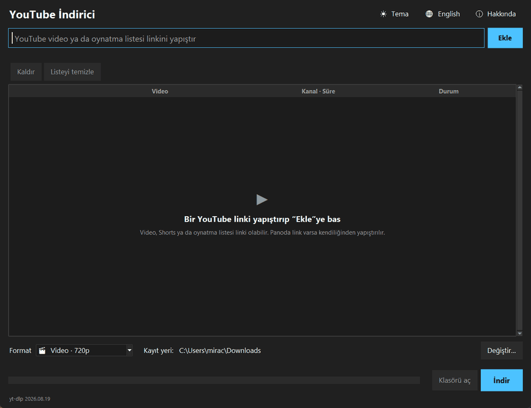
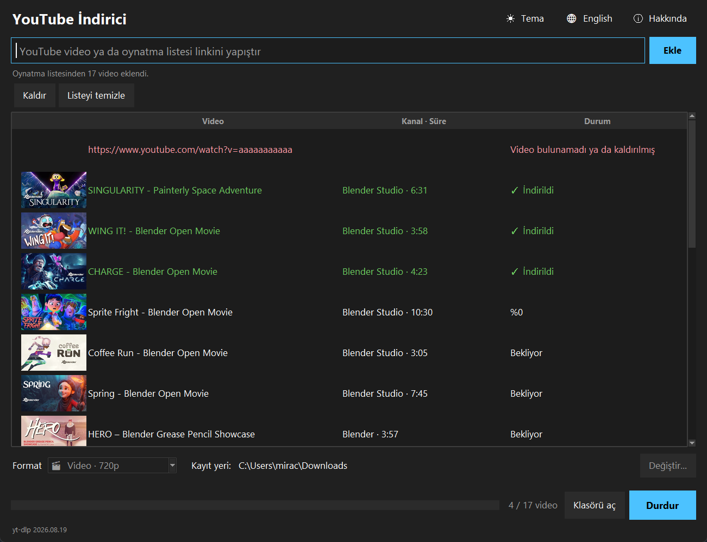
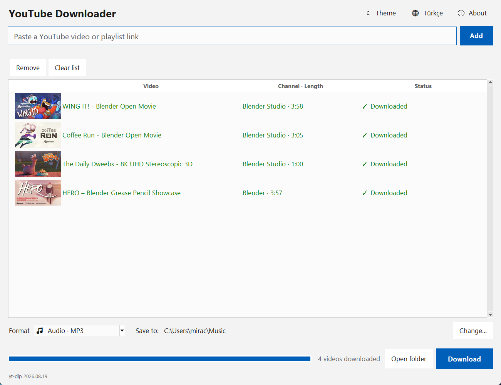

<p align="center">
  
</p>

<h1 align="center">YouTube İndirici</h1>

<p align="center">
  <a href="README.md">English</a> | <b>Türkçe</b>
</p>

<p align="center">
  yt-dlp ile YouTube videolarını, oynatma listelerini ve sesleri indiren, Python ve Tkinter ile yazılmış bir masaüstü uygulaması.<br>
  yt-dlp'yi ve YouTube'un artık istediği JavaScript çalıştırıcısını kendisi güncelleyerek yayından sonra da çalışmaya devam eder.
</p>

<p align="center">
  <a href="https://github.com/MrcDprm/youtube-downloader/releases/latest"><b>⬇️ Windows için indir</b></a>
</p>

<p align="center">
  
</p>

> ⚠️ **Sadece kişisel kullanım içindir.** Yalnızca sahibi olduğun ya da indirme izni olan videoları indir; YouTube Hizmet Şartları'na ve telif hakkı yasalarına uy. Uygulama YouTube'a giriş yapmaz; gizli, sadece üyelere açık ya da DRM korumalı içerikleri indiremez.

## Özellikler

**İndirme**
- Video, Shorts ya da oynatma listesi linkini yapıştır; indirmeden önce başlık, kanal, süre ve küçük resim görünür
- Uygulamaya dönünce panodaki YouTube linki kendiliğinden yapıştırılır
- **Video** MP4 olarak en iyi kalitede ya da 2160p, 1440p, 1080p, 720p, 480p, 360p; dosyalar her yerde açılsın diye H.264 + AAC tercih edilir
- **Ses** MP3 (192 kbps) ya da M4A olarak; başlık ve kanal dosyanın etiketlerine yazılır
- Oynatma listesindeki bütün videolar kuyruğa eklenir; tekrarlar atlanır
- İndirmeler sırayla, yüzde, hız ve kalan süreyle yapılır; tek düğme kuyruğu durdurur

**Çalışmaya devam eder**
- YouTube sık değiştiği için yt-dlp birkaç haftada bir yeni sürüm çıkarır. Uygulama açılışta PyPI'ye bakar, yeni yt-dlp'yi arka planda indirir, **SHA-256 özetini doğrular** ve hemen kullanır
- YouTube artık bir JavaScript çalıştırıcısı istiyor; [Deno](https://deno.com) ilk kullanımda aynı şekilde indirilip doğrulanır
- İnternet yoksa uygulama kurulumla gelen sürümle çalışmaya devam eder

**Güvenlik**
- Sadece YouTube linkleri kabul edilir; diğer her şey yt-dlp'ye ulaşmadan reddedilir
- Var olan dosyaların üzerine yazılmaz; dosya adları Windows için güvenli hâle getirilir
- Durdurulan indirmenin yarım parçaları silinir
- Gizli, kaldırılmış, yaş sınırlı, bölgeye kapalı ve canlı videolar, engellenen istekler ve bağlantı hataları için anlaşılır mesajlar

**Arayüz**
- Kayıt klasörü (varsayılan İndirilenler), "Klasörü aç", biten videoya çift tıklayınca Gezgin'de gösterme
- Koyu ve açık tema, Türkçe ve İngilizce arayüz, hatırlanan ayarlar

**Diğer**
- Hiçbiri internet bağlantısı gerektirmeyen 33 birim testi
- FFmpeg dahil kurulum sihirbazı

## Ekran Görüntüleri

**Oynatma listesi indirilirken (koyu, Türkçe)**



| Ses indirme (açık, İngilizce) | Boş pencere |
|---|---|
|  |  |

## Kurulum

1. [Releases](https://github.com/MrcDprm/youtube-downloader/releases/latest) sayfasından `YouTubeDownloader-x.y.z-Setup.exe` dosyasını indir.
2. Çalıştır ve kurulum adımlarını izle. Yönetici izni gerekmez. FFmpeg kurulumla birlikte gelir.
3. Uygulamayı Başlat menüsünde **YouTube İndirici** adıyla bul. Arayüz Türkçe açılır; sağ üstteki dil düğmesi İngilizceye çevirir.
4. İlk açılışta uygulama Deno'yu (yaklaşık 42 MB) bir kez indirir; alttaki satırda ilerlemesi görünür.

> **Windows "Bilgisayarınız korundu" uyarısı:** Uygulama dijital olarak imzalı olmadığı için Windows SmartScreen ilk açılışta uyarı gösterebilir. **Ek bilgi → Yine de çalıştır** ile devam edebilirsin. Kaynak kodun tamamı bu depoda açık.

**Kaldırma:** Ayarlar → Uygulamalar → Yüklü uygulamalar → YouTube İndirici → Kaldır.
Ayarlar ve indirilen bileşenler `%USERPROFILE%\.youtube-downloader` klasöründe tutulur; istersen elle silebilirsin.

## Klavye Kısayolları

| Tuş | İşlev |
|---|---|
| `Enter` (link kutusunda) | Linki ekle |
| `Delete` (listede) | Seçili videoları kaldır |
| `Ctrl+Enter` | İndirmeyi başlat ya da durdur |

## Kullanılan Teknolojiler

- **Python 3.12** ve **Tkinter / ttk**: kullanıcı arayüzü
- **[yt-dlp](https://github.com/yt-dlp/yt-dlp)** (kütüphane olarak) ve **[Deno](https://deno.com)**: YouTube ile konuşma
- **[FFmpeg](https://ffmpeg.org)**: görüntü ile sesi birleştirme, MP3'e dönüştürme
- **[Pillow](https://python-pillow.org)**: küçük resimler
- **urllib, hashlib, zipfile**: PyPI'den doğrulanmış kendi kendine güncelleme
- **threading, queue**: arka plan işleri
- **unittest**: testler
- **PyInstaller** ve **Inno Setup**: Windows kurulum dosyası

## Proje Yapısı

```
youtube-downloader/
├── main.py          # Giriş noktası
├── gui.py           # Tkinter arayüzü: link kutusu, kuyruk, seçenekler, ilerleme
├── links.py         # YouTube linklerini tanır ve sadeleştirir
├── formats.py       # Kalite ve ses seçimlerini yt-dlp ayarlarına çevirir
├── downloader.py    # Video bilgisi, indirme, ilerleme, durdurma, hata mesajları
├── updater.py       # yt-dlp'yi, betiklerini ve Deno'yu PyPI'den güncel tutar
├── thumbnails.py    # Küçük resimleri indirip küçültür
├── settings.py      # Hatırlanan seçenekler
├── i18n.py          # Türkçe ve İngilizce metinler
├── storage.py       # JSON dosyalarını kullanıcı klasörüne kaydeder
├── app_info.py      # Uygulama adı, sürüm, FFmpeg'i bulma
├── scripts/         # Paketleme için doğrulanmış FFmpeg indirir
├── assets/          # Uygulama ikonu
├── docs/            # README görselleri
├── installer/       # Inno Setup betiği
└── tests/           # Testler
```

## Kaynak Koddan Çalıştırma

Python 3.12 veya daha yenisi ve `PATH`'te FFmpeg gerekir (ör. `winget install Gyan.FFmpeg`).

```bash
python -m pip install yt-dlp yt-dlp-ejs pillow
python main.py           # uygulamayı çalıştır (Deno ilk açılışta indirilir)
python -m unittest -v    # testleri çalıştır
```

### Kurulum dosyasını derleme

[PyInstaller](https://pyinstaller.org) ve [Inno Setup 6](https://jrsoftware.org/isinfo.php) gerekir.

```bash
python scripts/fetch_ffmpeg.py    # FFmpeg'i vendor/ klasörüne indirir ve SHA-256 özetini kontrol eder
python -m PyInstaller --noconfirm YouTubeDownloader.spec
ISCC installer/youtube-downloader.iss
```

Kurulum dosyası `installer/Output/` klasöründe oluşur.

**Yeni sürüm yayınlarken:** Sürüm numarasını hem `app_info.py` (`VERSION`) hem `installer/youtube-downloader.iss` (`AppVersion`) içinde güncelle, testleri çalıştır, derleme komutlarını çalıştır ve kurulum dosyasını yeni bir GitHub Release'e yükle.

## Öğrendiklerim

- **Başkasının sitesine bağlı yazılım eskir.** YouTube sürekli değişiyor; yayın anında dondurulmuş bir indirici birkaç haftada bozulurdu. Uygulamanın yt-dlp'yi kendisi güncellemesini sağladım: PyPI'nin JSON API'sinden son sürümü okuyor, paketi indiriyor, SHA-256 özetini kontrol ediyor ve yüklüyor. Bir wheel'in (`.whl`) aslında zip dosyası olduğunu, `sys.path`'in başına koyunca Python'un doğrudan ondan içe aktarabildiğini öğrendim.
- **İndirilen kod doğrulanmalı.** Uygulama indirdiği kodu çalıştırdığı için her şeyi kullanmadan önce boyutunu, sunucusunu, dosya adını ve özetini kontrol ediyor; her yüklemeden önce özeti tekrar kontrol ediyor. Diskte değiştirilmiş bir dosya yok sayılıyor.
- **İçe aktarma sırası önemli.** Python bir modülü ilk içe aktarmadan sonra önbellekte tutuyor. Bu yüzden yt-dlp'yi fonksiyonların içinde, güncelleyici en yeni sürümü etkinleştirdikten sonra içe aktarıyorum.
- **Bir kütüphaneyi kancalarla (hook) kullanmak.** yt-dlp ilerlemeyi geri çağırma fonksiyonlarıyla bildiriyor. Ayrı inen görüntü ve sesi tek, akıcı bir yüzdede birleştirdim, kalan süreyi kendim hesapladım ve indirmeyi kancanın içinden istisna fırlatarak durdurdum.
- **Kullanıcı girdisine ve uzak veriye güvenmemek.** Linkler ayrıştırılıp YouTube sunucularının tam listesiyle karşılaştırılıyor; taklit alan adları ve başka siteler yt-dlp'ye hiç ulaşmıyor. YouTube'dan gelen başlıklar dosya adı olmadan önce temizleniyor, küçük resimlerin boyutu ve biçimi kontrol ediliyor.
- **Pencereyi akıcı tutmak.** Güncelleme, video bilgisi okuma, küçük resim yükleme ve indirme ayrı iş parçacıklarında çalışıp sonuçlarını bir kuyrukla bildiriyor. Bir `threading.Event`, bileşenler hazır olana kadar bilgi okuyucuyu bekletiyor.
- **Teknik hataları anlaşılır mesajlara çevirmek.** yt-dlp sadece hata metni veriyor. Bilinen ifadeleri anlaşılır mesajlarla eşleştirdim (gizli, yaş sınırlı, bölgeye kapalı, engellendi); YouTube'un gerçek ifadesiyle yazdığım bir test eşleşmeyen bir kalıbı yakaladı.
- **Küçük ayrıntılar fark yaratıyor.** Panodaki linki kendiliğinden yapıştırmak, link hâlâ okunurken "İndir"e basılabilmesi ve Tkinter resimleri kaybetmesin diye küçük resimlerin referansını tutmak, uygulamayı kullanırken fark ettiğim şeylerdi.

## Gelecek Planları

- Altyazılar
- Videonun bir bölümünü indirme (başlangıç ve bitiş zamanı)
- Aynı anda birden fazla indirme
- Kanal indirme
- macOS ve Linux paketleri

## Lisans

[MIT](LICENSE) © 2026 Miraç Deprem

Kurulum dosyası [FFmpeg](https://ffmpeg.org)'i (GPL v3, [gyan.dev](https://www.gyan.dev/ffmpeg/builds/) statik derlemesi) içerir; lisansı ve kaynak kodu linki kurulumdaki `vendor` klasöründedir. [yt-dlp](https://github.com/yt-dlp/yt-dlp) Unlicense, [Deno](https://github.com/denoland/deno) MIT lisansıyla yayınlanmıştır.
